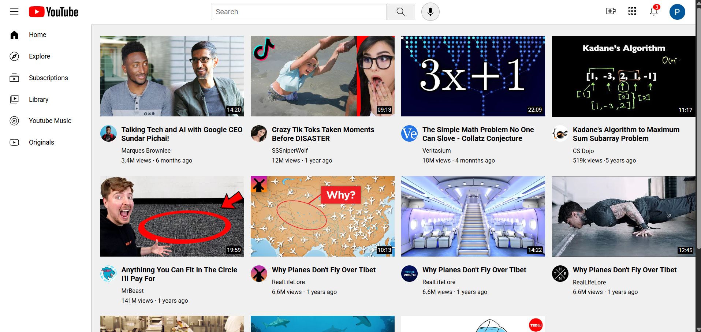

# YouTube Clone

A responsive YouTube homepage clone built using **HTML, CSS, and JavaScript**. I created this project to practice building real-world web interfaces and to understand how different frontend concepts work together.

The project includes a YouTube-style navigation bar, sidebar, search bar, video grid, responsive layout, dark/light theme, and a video player popup.

🌐 Live Demo: [https://youtube-clone-pied-delta.vercel.app/](https://youtube-clone-pied-delta.vercel.app/)

## Preview

[](https://drive.google.com/file/d/1442C6TS5-W1AAB7cfoty1QpVKjBuvuJd/view?usp=sharing)

Click the preview image to watch the demo.

## Features

- Responsive design for desktop, tablet, and mobile
- YouTube-style header, sidebar, and video grid
- Search bar UI
- Dark and light theme toggle
- Theme preference saved using localStorage
- Click on a video thumbnail to open and play the video
- YouTube video embedding inside a popup
- Hover effects and interactive elements
- Semantic HTML structure
- Organized CSS files for different sections

## Technologies Used

- HTML5
- CSS3
- JavaScript
- Flexbox
- CSS Grid
- Media Queries
- DOM Manipulation
- Local Storage
- YouTube Embed

## Folder Structure

```text
youtube-clone/
│
├── icons/
├── profiles/
├── thumbnails/
│
├── general.css
├── header.css
├── sidebar.css
├── video.css
├── script.js
│
├── index.html
├── screenshot.png
└── README.md
```

## What I Learned

While building this project, I got hands-on experience with responsive layouts, Flexbox, CSS Grid, JavaScript DOM manipulation, event handling, localStorage, theme switching, and embedding YouTube videos.

It also helped me understand how a real-world website can be broken down into smaller reusable sections and styled using separate CSS files.

## Future Improvements

- Functional search
- Sidebar toggle for mobile
- Video recommendations
- Like and comment functionality
- YouTube Data API integration
- User authentication

## Disclaimer

This project is created for educational purposes and is not affiliated with or endorsed by YouTube. All logos, images, icons, videos, and trademarks belong to their respective owners.

## Author

**Nikhesh Pasupuleti**

GitHub: https://github.com/Nikhesh-2202

LinkedIn: https://www.linkedin.com/in/nikhesh-pasupuleti-34a741332/
